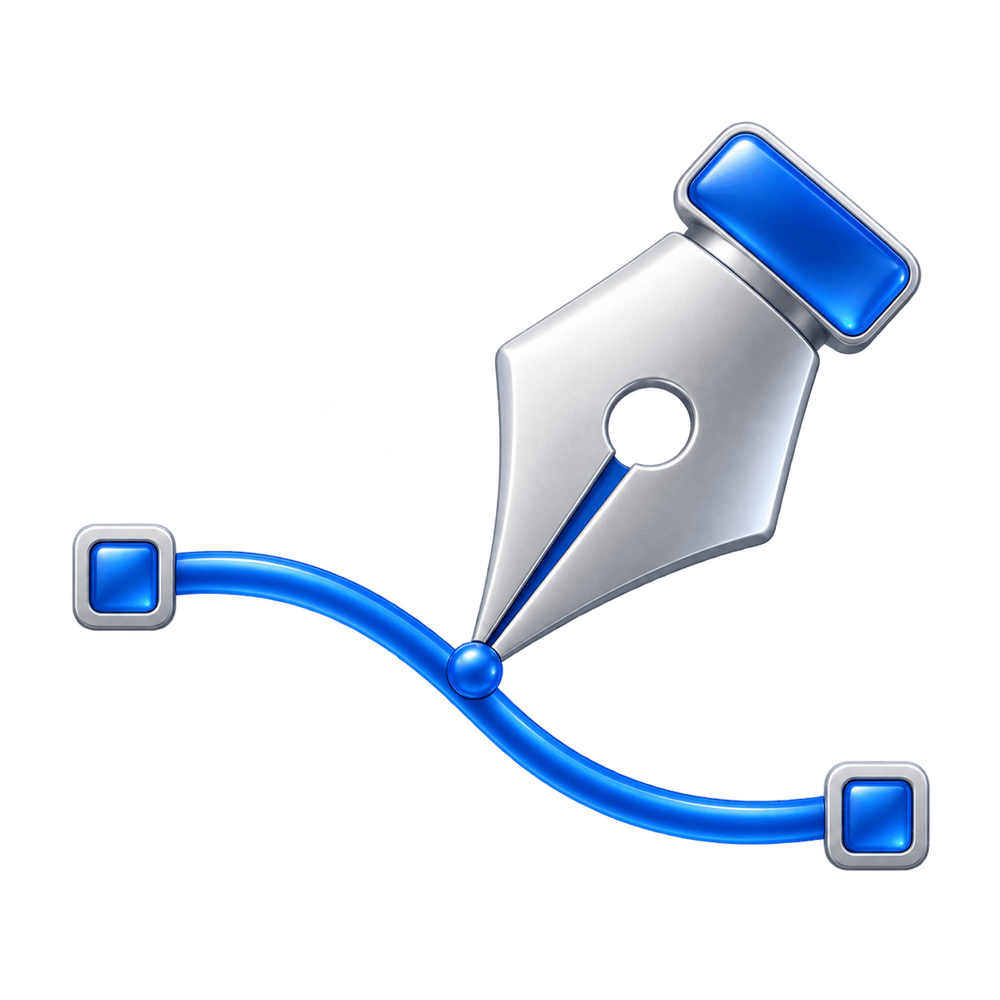
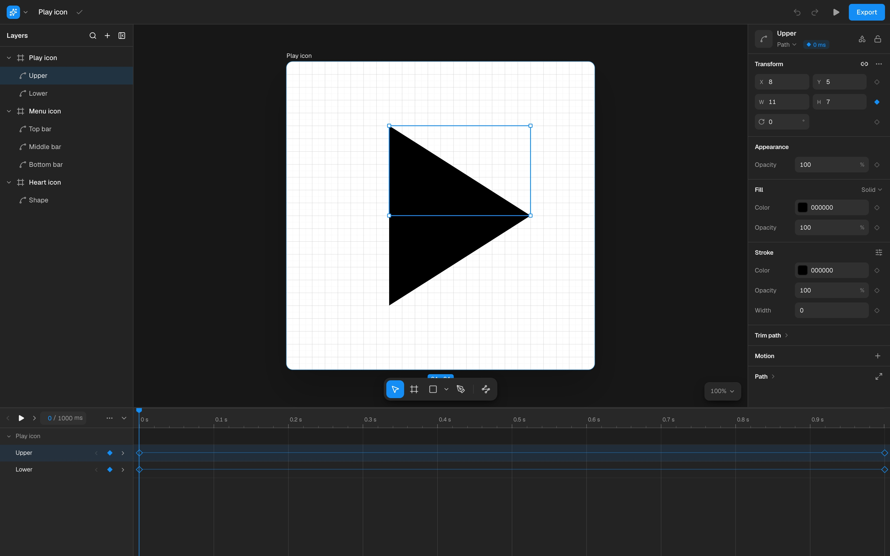

  

<h1 align="center">Pathshift</h1>

  <strong>Draw vectors. Make them move.</strong> 
  A vector and motion editor for Android assets, right in your browser.

  <a href="#your-first-animation">Get started</a> ·
  <a href="#exports">Exports</a> ·
  <a href="docs/development.md">Run locally</a>

Draw an icon, refine its curves, then give it motion. Pathshift brings vector
editing, path morphing, and animation into one workspace, with native
**VectorDrawable** and **AnimatedVectorDrawable** exports for Android.

Bring your own SVG or Android XML, or start with a built-in example. No account
or API key required.

## From a path to an animation

- **Draw and refine.** Pen, Rectangle, and Ellipse tools; editable anchors and
  Bézier handles; snapping; and curve-preserving Union, Subtract, Intersect,
  and Exclude operations.
- **Build your artwork.** Organize paths and groups across artboards. Adjust
  fills, linear and radial gradients, strokes, clipping, pivots, and trim paths.
- **Give it motion.** Animate position, rotation, scale, opacity, colors,
  strokes, and path geometry. Start with Spin, Tilt, Pulse, Pop, Fade, or Draw
  presets, then edit their timeline segments.
- **Shape the timing.** Drag keyframes, snap moments together, edit exact
  values, and tune easing with Bézier controls and value or velocity graphs.
- **Make a morph.** Edit both endpoint shapes and prepare their path commands
  for a compatible transition.
- **Keep editing anywhere.** Use the full workspace on desktop or switch
  between Layers, Design, and Motion panels on smaller screens. Pan and pinch
  to zoom the canvas with touch gestures.

## Your first animation

1. **Choose artwork.** Open **Examples** in the main menu, import an SVG or
   Android XML through **File**, or draw a path with the Pen tool.
2. **Add motion.** Select a layer and choose a preset in the inspector’s **Motion** section, or click
   the diamond beside a property in **Design** to animate it.
3. **Set another pose.** Move the playhead and change the property. Edit the
   resulting timeline segment’s values and timing to refine the movement.
4. **Make it feel right.** Press Play, scrub the timeline, and adjust easing.
   Use a preview range to focus on one part of the animation. Enable **Show next
   pose** in Motion’s **Timeline options (⋯)** to see a ghost of the selected
   object at its next keyframe. The ghost hides during playback and at the final key.
5. **Export.** Choose **Animated Vector** for an Android animation ZIP,
   **Vector Drawable** for static Android XML, or **Project** to keep an
   editable copy. The export dialog identifies unsupported features before
   you download.

For a walkthrough, open **Make an icon move** from Editor help or the command
palette. For a path morph, use **Edit → Path → Make morph-compatible** to align
the endpoint commands, then check the transition visually.

## Exports

Android is the primary target. Other formats cover specific uses rather than
promising the same result everywhere.

| Format                                         | What you get                                                                                                          |
| ---------------------------------------------- | --------------------------------------------------------------------------------------------------------------------- |
| **VectorDrawable · XML**                       | Static artwork with supported paths, groups, styling, clipping, and Android metadata.                                 |
| **AnimatedVectorDrawable · ZIP**               | Supported animation bundled as drawable, animator, and interpolator resources. Incompatible path morphs block export. |
| **SVG**                                        | Static vector artwork, including supported clipping and trim geometry.                                                |
| **Project · JSON**                             | The editable document, artboards, layers, animation, and Android metadata. Reopen it to keep working.                 |
| **Lottie · JSON**                              | Experimental export of supported geometry, transforms, opacity, colors, and easing. Trim tracks are omitted.          |
| **PDF**                                        | Experimental static vector export; unsupported paint or transform details may be approximated.                        |
| **Morph demo · SVG, CSS, or SVG sprite sheet** | An experimental From → To demonstration of the selected path, rather than the complete artwork or timeline.           |

Static SVG, VectorDrawable, and PDF exports use the artwork’s **base pose**,
not the current playhead. Intrinsic Android dimensions and viewport coordinates
are preserved separately. The export dialog reports format-specific limits.

Import SVG, VectorDrawable XML, project JSON, or related Android animation XML
files together. Animation ZIP import supports the uncompressed archives
produced by this editor.

See [supported features and limitations](docs/support.md) for format details.

## Your work stays in this browser

Pathshift autosaves locally and keeps recovery checkpoints in
**File → Version history**. Undo and Redo cover committed edits, including
restoring a checkpoint. Conflicting saves from another tab are detected before
newer work is overwritten.

Download a **Project** file to back up your work or move it to another browser.
Local autosave is not cloud sync; clearing browser storage removes local saves.
See the [project file guide](docs/project-file.md) for what a backup contains.

## Useful controls

`Mod` means Command on macOS or Ctrl on Windows and Linux.

| Action                      | Control                                                    |
| --------------------------- | ---------------------------------------------------------- |
| Find a command              | `Mod K`                                                    |
| Move / edit vector points   | `V` / `A`                                                  |
| Pen / Rectangle / Ellipse   | `P` / `R` / `O`                                            |
| Pan / zoom                  | Hold `Space` and drag / pinch on touch screens             |
| Play / pause                | `Space` outside focused controls                           |
| Step one frame / ten frames | `,` or `.` / hold `Shift`                                  |
| Edit a keyframe             | Double-click, right-click, or press `Enter` on its diamond |
| Undo / redo                 | `Mod Z` / `Mod Shift Z`                                    |
| Fit all frames / selection  | `Shift 1` / `Shift 2`                                      |
| Show all shortcuts          | `?`                                                        |

## Work with an agent

Agents can inspect artwork, evaluate an animation pose, apply validated edits,
undo changes, and export through WebMCP. A batch of edits becomes one Undo step;
revision checks and gesture ownership protect work already in progress.

**File → Agent tools** provides inspection and batch editing in browsers without
native WebMCP support. See the [agent editing guide](docs/agent-editor.md) for
available commands and examples.

---

Pathshift is a modern reimagining of
[Alex Lockwood’s ShapeShifter](https://github.com/alexjlockwood/ShapeShifter),
built around vector drawing and Android motion.
