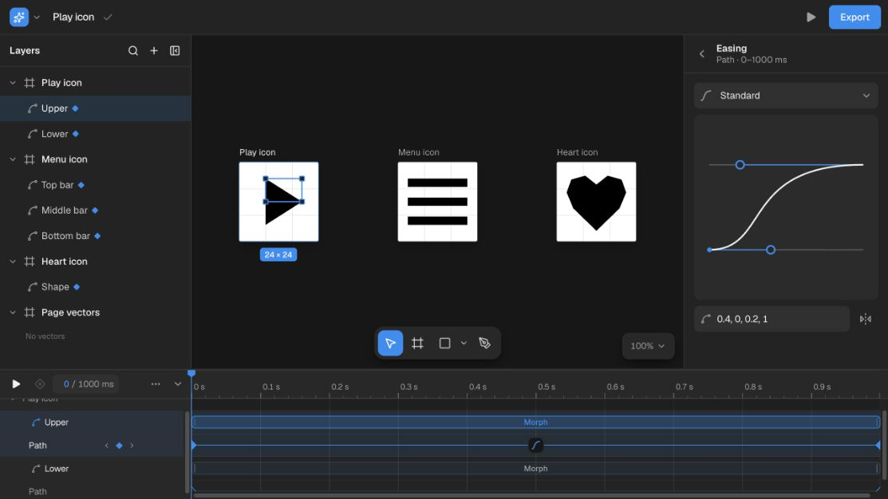

# ShapeShifter

**Draw vectors. Shape motion. Export Android.**

ShapeShifter is a browser-based vector and motion editor for **Android VectorDrawable and AnimatedVectorDrawable**. Draw precise paths, refine a morph, tune an easing curve, and export native Android resources from one workspace.

This is a modern React and TypeScript rewrite of [Alex Lockwood’s ShapeShifter](https://github.com/alexjlockwood/ShapeShifter), with direct vector editing, a property timeline, recovery history, and an editing interface for agents.



[Get started](#get-started) · [First animation](#your-first-animation) · [Formats](#import-and-export) · [Agent tools](#editing-with-agents) · [Development](#development)

## A workspace for vectors and motion

### Draw with precision

- **Pen, Rectangle, and Ellipse.** Place anchors, drag Bézier handles, close paths, and draw with grid snapping. Hold Shift for equal sides or Alt/Option to draw from the center.
- **Direct editing.** Select anchors and handles, move multiple points, edit fractional coordinates, or replace SVG path data with validation before it enters the document.
- **Curve-aware Boolean operations.** Union, Subtract, Intersect, and Exclude preserve curves and holes. Operations run in a worker and commit as one Undo step.
- **Structured artwork.** Organize paths, groups, and ordered clip paths; edit fills, gradients, stroke details, trim paths, transforms, and pivots. Selection and hit testing follow nested transforms and the evaluated animation pose.

### Make the motion feel right

- **Property animation.** Animate geometry, position, rotation, scale, opacity, colors, stroke width, and trim paths, with the supported properties exposed for each layer type.
- **Precise timing.** Snap to nearby keyframes, the playhead, and the grid with a visible guide. Move selected segments together while preserving their spacing and linked endpoints; hold Alt/Option to bypass snapping.
- **Direct keyframe editing.** Double-click, right-click, or press Enter on a diamond to edit its exact time and value beside the timeline. Insert at the playhead, copy compatible segments, zoom and pan, or preview the full animation or a selected range with forward or back-and-forth playback.
- **Custom easing.** Use Android presets or edit cubic Bézier handles and their numeric coordinates. Numeric motion preserves overshoot.
- **Value and velocity graphs.** Inspect one numeric segment with property units and the same easing calculation used by playback.
- **Morph preparation.** Edit both path endpoints and resolve command compatibility before generating an Android animation.

### Keep work recoverable

Undo and Redo cover committed edits, including agent batches and recovery restores. The save indicator shows when the browser-local document is saving, saved, or needs attention. **File → Version history** exposes retained checkpoints; conflicting saves from another tab are detected before overwriting newer work.

Export project JSON for a portable backup. Autosave lives in this browser’s storage; it is not cloud sync.

## Get started

Requires **Node.js 24.x** and **pnpm 11.22.0**, as pinned in [package.json](package.json).

```bash
git clone https://github.com/bernaferrari/ShapeShifter.git
cd ShapeShifter
pnpm install --frozen-lockfile
pnpm dev
```

Open [localhost:3000](http://localhost:3000). If that port is occupied, use `pnpm dev --port 3001` and open the corresponding address. No account or API key is required for local editing.

For a production build:

```bash
pnpm build
pnpm start
```

## Your first animation

1. **Start with artwork.** Choose a built-in example from **Samples**, or use **File → Import SVG / XML / Project…** to bring in an asset.
2. **Shape the vector.** Use Move (`V`), Vector (`A`), or Pen (`P`). Keep related artwork in groups and give animation targets meaningful names.
3. **Add motion.** Select a layer and choose **Animate** beside a supported property in the inspector. Select the resulting timeline segment to edit its From, To, Start, and End values.
4. **Refine the transition.** Scrub or play the timeline, choose an easing preset, or adjust a custom curve. Expand the value graph to inspect overshoot; switch to velocity to inspect changes in speed.
5. **Prepare a morph when needed.** Edit the start and end paths and use **Prepare for morph** to align their command structures. Android morphs require matching command types and counts.
6. **Export.** Choose **Vector XML** for base artwork or **Android AVD** for the animation resource ZIP. Read the preflight diagnostics and resolve blocking errors before download.

Intrinsic dimensions and viewport dimensions are separate. A drawable can be `24dp × 24dp` while using a different coordinate system internally; preserve both when importing and exporting Android assets.

### Useful shortcuts

`Mod` means Command on macOS and Ctrl on Windows or Linux. Shortcuts respect text inputs, dialogs, and focused controls.

| Action                         | Shortcut                                             |
| ------------------------------ | ---------------------------------------------------- |
| Search commands                | `Mod K`                                              |
| Move / direct vector editing   | `V` / `A` or `D`                                     |
| Pen / Rectangle / Ellipse      | `P` / `R` / `O`                                      |
| Pan the canvas                 | Hold `Space` and drag, or hold `H`                   |
| Play / pause                   | Tap `Space` outside focused controls                 |
| Previous / next frame          | `,` / `.` (hold `Shift` for 10 frames)               |
| Animate a property             | Click the ◇ beside it in the properties panel        |
| Keyboard shortcuts             | `?`                                                  |
| Fit all frames / fit selection | `Shift 1` / `Shift 2`                                |
| Reset zoom                     | `0`                                                  |
| Undo / Redo                    | `Mod Z` / `Mod Shift Z`                              |
| Duplicate                      | `Mod D`                                              |
| Group / Ungroup                | `Mod G` / `Mod Shift G`                              |
| Rename a layer                 | `F2` in the layer tree                               |
| Edit a timeline keyframe       | Double-click, right-click, or `Enter` on its diamond |
| Bypass timeline snapping       | Hold `Alt` / `Option` while dragging                 |
| Cancel a timeline drag         | `Escape`                                             |
| Finish a Pen path              | `Enter` or `Escape`; click the first anchor to close |

## Import and export

Android is the canonical target. Other formats have their own fidelity limits, which the export dialog reports before download.

| Format                                             | Import                                                                      | Export scope and behavior                                                                                                                                 |
| -------------------------------------------------- | --------------------------------------------------------------------------- | --------------------------------------------------------------------------------------------------------------------------------------------------------- |
| **VectorDrawable XML**                             | Yes                                                                         | Active artwork’s base geometry, styling, groups, clip paths, dimensions, and supported Android metadata.                                                  |
| **AnimatedVectorDrawable**                         | ShapeShifter’s uncompressed AVD ZIP, or related XML files imported together | Active artwork and supported timeline tracks, bundled as drawable, animator, and interpolator resources in a ZIP. Incompatible morphs block export.       |
| **ShapeShifter project JSON**                      | Yes                                                                         | Full editable project, including owners, animation, morph endpoints, and Android metadata. Use it for backup and interchange.                             |
| **Static SVG**                                     | Yes                                                                         | Active artwork’s base pose, including evaluated static trim geometry.                                                                                     |
| **Animated SVG / CSS keyframes / SVG spritesheet** | SVG artwork only                                                            | Selected path’s From → To morph. These are not full timeline exports.                                                                                     |
| **Lottie JSON**                                    | No                                                                          | Active artwork and supported geometry, transform, opacity, and color animation. Trim tracks are not emitted; unsupported semantics produce diagnostics.   |
| **PDF**                                            | No                                                                          | Active artwork’s base pose, with fills, strokes, clipping, and transparency. Unsupported paint or transform details may be approximated with diagnostics. |

Static exports use **base artwork**, not the current playhead pose. The timeline’s 24/30/60 fps setting controls authoring display and snapping; it does not set the destination renderer’s frame rate.

For feature-level detail, see [supported features and limitations](docs/support.md). The [project file guide](docs/project-file.md) describes the editable JSON format.

## Editing with agents

ShapeShifter exposes seven WebMCP tools when the browser provides `document.modelContext` or the older `navigator.modelContext`:

| Tool                                      | Purpose                                                                      |
| ----------------------------------------- | ---------------------------------------------------------------------------- |
| `shapeshifter_inspect`                    | Discover owners, layer IDs, capabilities, and the current revision.          |
| `shapeshifter_evaluate`                   | Inspect the evaluated scene at a given time.                                 |
| `shapeshifter_apply`                      | Apply a validated batch of document edits as one Undo step.                  |
| `shapeshifter_select`                     | Select explicit owner-qualified layers.                                      |
| `shapeshifter_undo` / `shapeshifter_redo` | Use the same history as the human editor.                                    |
| `shapeshifter_export`                     | Return an export and its fidelity diagnostics without changing editor state. |

The editing sequence is **inspect → evaluate → apply → inspect**. Writes require explicit owner and layer IDs plus an expected revision. An invalid command rejects the whole batch; stale revisions, locked layers, playback, and active gestures prevent competing writes.

**File → Agent tools** exposes inspection and batch editing in browsers without native WebMCP. Browser transports may append session suffixes to tool names; discover them from the current page.

See the [agent editing guide](docs/agent-editor.md) for command schemas, a complete example, revision handling, and the export contract.

## Development

The app uses **Next.js 16, React 19, TypeScript, Tailwind CSS 4, and Zustand**. Vitest covers behavior; Oxlint and Oxfmt handle linting and formatting. Paper.js supplies the curve Boolean kernel.

| Command          | Purpose                                      |
| ---------------- | -------------------------------------------- |
| `pnpm dev`       | Start the development server with Turbopack. |
| `pnpm build`     | Build for production.                        |
| `pnpm start`     | Serve the production build.                  |
| `pnpm typecheck` | Check TypeScript types.                      |
| `pnpm lint`      | Run Oxlint.                                  |
| `pnpm test`      | Run the Vitest suite.                        |
| `pnpm format`    | Format the repository with Oxfmt.            |

Before submitting a change, run the same checks as [CI](.github/workflows/ci.yml):

```bash
pnpm typecheck
pnpm lint
pnpm test
pnpm build
```

On machines with limited memory, run `pnpm test --maxWorkers=4`. To focus on a regression, pass its test-file path to `pnpm test`.

### Code map

| Path                                                                         | Responsibility                                                                |
| ---------------------------------------------------------------------------- | ----------------------------------------------------------------------------- |
| [`app/`](app/)                                                               | Application shell, editor page, and global styles.                            |
| [`components/editor/`](components/editor/)                                   | Canvas, layers, inspector, timeline, dialogs, and keyboard interaction.       |
| [`lib/shapeshifter/path/`](lib/shapeshifter/path/)                           | Geometry, direct editing, validation, trim evaluation, and Boolean worker.    |
| [`lib/shapeshifter/scene/`](lib/shapeshifter/scene/)                         | Evaluated scene shared by rendering, selection, bounds, and hit testing.      |
| [`lib/shapeshifter/motion/`](lib/shapeshifter/motion/)                       | Timeline authoring, keyframes, preview ranges, and motion graph calculations. |
| [`lib/shapeshifter/androidCompiler.ts`](lib/shapeshifter/androidCompiler.ts) | Native Android resource compilation and diagnostics.                          |
| [`lib/shapeshifter/export/`](lib/shapeshifter/export/)                       | Project, Lottie, and PDF exporters.                                           |
| [`lib/store/`](lib/store/)                                                   | Editor state, document transactions, history, and local recovery.             |
| [`lib/agent/`](lib/agent/)                                                   | Validated agent commands and WebMCP registration.                             |
| [`plans/`](plans/)                                                           | Implementation plans, acceptance criteria, and review evidence.               |

### Contributing

Keep the canvas, selection, hit testing, persistence, and exports consistent for the same document. Geometry and animation changes should include regression coverage for the behavior they affect. Test cancellation and Undo as well as the successful edit; document target-specific approximations instead of silently discarding unsupported data.

The [editor quality review](plans/editor-quality-review.md) records production-browser acceptance checks, regression results, screenshots, and remaining limits. Include a reproducible asset or project file when reporting an import, morph, or export issue.

## Scope

ShapeShifter focuses on Android vector assets and their motion. Typography, reusable design components, layout constraints, multiplayer editing, cloud sync, and a document library are outside the current feature set.

Boolean operations require static, closed, visibly filled paths within one owner. Animated, masked, locked, or otherwise unsupported operands are refused with an explanation. Lottie, PDF, and the selected-path web animation exports remain experimental interoperability targets.

## License and acknowledgments

Licensed under [Apache 2.0](LICENSE). See [NOTICE](NOTICE) for attribution.

ShapeShifter builds on the original work of **Alex Lockwood**. This repository retains the Android vector and animation focus while rebuilding the editor and its workflows for a modern web stack. Third-party dependencies retain their respective licenses; Paper.js is MIT licensed.
